# Architecture de l'Application de Gestion des Congés

## Vue d'Ensemble

Cette application est un système de gestion des congés basé sur une architecture moderne et sécurisée utilisant React, TypeScript, Supabase et un système d'approbation hiérarchique en cascade.

## Architecture Globale


## Flux d'Authentification

### Diagramme de Séquence - Connexion


### Initialisation de l'Application


## Architecture des Composants

### Hiérarchie des Composants


### Flux de Données - Contexte d'Authentification


## Workflow d'Approbation des Congés

### Vue d'Ensemble du Workflow


### Flux Détaillé de Soumission de Demande


### Flux d'Approbation par Niveau


### Matrice d'Approbation

| Niveau | Rôle | Status Initial | Status après Approbation | Action sur Rejet |
|--------|------|---------------|-------------------------|------------------|
| 1 | Chef de Cellule | `pending_cell_manager` | `pending_service_chief` | `rejected` |
| 2 | Chef de Service | `pending_service_chief` | `pending_hr` | `rejected` |
| 3 | Responsable RH | `pending_hr` | `approved` | `rejected` |

## Sécurité et Contrôle d'Accès

### Row Level Security (RLS)

```mermaid
graph TB
    subgraph "Politiques RLS - leave_requests"
        P1[Users can view their own requests]
        P2[Users can create their own requests]
        P3[Users can update their pending requests]
        P4[Managers can view team requests]
        P5[Managers can update requests]
    end
    
    subgraph "Politiques RLS - profiles"
        P6[Users can view their own profile]
        P7[Users can update their own profile]
        P8[Admins can view all profiles]
        P9[Admins can update all profiles]
    end
    
    subgraph "Politiques RLS - user_roles"
        P10[Users can view their own roles]
        P11[Admins can manage all roles]
    end
    
    Auth[auth.uid()] --> P1
    Auth --> P2
    Auth --> P3
    Auth --> P6
    Auth --> P7
    Auth --> P10
    
    HasRole[has_role function] --> P4
    HasRole --> P5
    HasRole --> P8
    HasRole --> P9
    HasRole --> P11
    
    style Auth fill:#ffe6e6
    style HasRole fill:#e6f3ff
```

### Fonction de Vérification de Rôle

```sql
-- Fonction SECURITY DEFINER pour éviter la récursion RLS
CREATE OR REPLACE FUNCTION has_role(_user_id uuid, _role app_role)
RETURNS boolean
LANGUAGE sql
STABLE SECURITY DEFINER
AS $$
  SELECT EXISTS (
    SELECT 1
    FROM public.user_roles
    WHERE user_id = _user_id
    AND role = _role
  )
$$;
```

### Flux de Vérification des Permissions

```mermaid
graph LR
    Request[Requête utilisateur] --> Auth{Auth.uid()?}
    Auth -->|Non authentifié| Deny[Accès refusé]
    Auth -->|Authentifié| RLS{Vérification RLS}
    
    RLS --> OwnData{Propres données?}
    OwnData -->|Oui| Allow[Accès autorisé]
    OwnData -->|Non| CheckRole{Vérifier rôle}
    
    CheckRole --> HasRole[has_role function]
    HasRole -->|Admin/Manager| Allow
    HasRole -->|Non autorisé| Deny
    
    style Deny fill:#ffcccc
    style Allow fill:#ccffcc
```

## Gestion des Utilisateurs (Admin)

### Flux de Création d'Utilisateur


### Flux de Suppression d'Utilisateur


## Modèle de Données

### Schéma de Base de Données

```mermaid
erDiagram
    AUTH_USERS ||--o{ PROFILES : "1:1"
    AUTH_USERS ||--o{ USER_ROLES : "1:N"
    AUTH_USERS ||--o{ LEAVE_REQUESTS : "1:N"
    
    AUTH_USERS {
        uuid id PK
        string email
        timestamp created_at
    }
    
    PROFILES {
        uuid id PK
        uuid user_id FK
        string email
        string first_name
        string last_name
        string phone
        string department
        string position
        boolean must_change_password
        timestamp created_at
        timestamp updated_at
    }
    
    USER_ROLES {
        uuid id PK
        uuid user_id FK
        app_role role
        timestamp created_at
    }
    
    LEAVE_REQUESTS {
        uuid id PK
        uuid user_id FK
        date start_date
        date end_date
        string type
        text reason
        string status
        uuid approver_id
        timestamp approved_at
        timestamp created_at
        timestamp updated_at
    }
```



## Interaction Frontend-Backend

### Pattern de Communication

```mermaid
graph TB
    subgraph "Frontend Layer"
        Component[React Component]
        Hook[Custom Hook]
        Context[React Context]
    end
    
    subgraph "API Layer"
        Client[Supabase Client]
        Query[Query Builder]
    end
    
    subgraph "Backend Layer"
        API[Supabase REST API]
        RLS[RLS Engine]
        DB[(PostgreSQL)]
    end
    
    Component --> Hook
    Component --> Context
    Hook --> Client
    Context --> Client
    Client --> Query
    Query --> API
    API --> RLS
    RLS --> DB
    
    DB --> RLS
    RLS --> API
    API --> Client
    Client --> Component
    
    style "Frontend Layer" fill:#e1f5ff
    style "API Layer" fill:#fff4e1
    style "Backend Layer" fill:#e1ffe1
```

### Exemple de Requête avec RLS

```typescript
// Frontend - Le client envoie simplement la requête
const { data: requests } = await supabase
  .from('leave_requests')
  .select('*')
  .eq('status', 'pending_cell_manager');

// Backend - RLS filtre automatiquement selon le rôle
// Si employé: Retourne seulement ses demandes (auth.uid() = user_id)
// Si manager: Retourne toutes les demandes de son équipe (has_role check)
```

## Gestion des États

### États Globaux (AuthContext)

```mermaid
graph TB
    subgraph "AuthContext State"
        User[user: User | null]
        Loading[loading: boolean]
        IsAuth[isAuthenticated: boolean]
    end
    
    subgraph "User Object"
        ID[id: string]
        Email[email: string]
        Name[firstName, lastName]
        Role[role: UserRole]
        Dept[department, position]
        Balance[leaveBalance: number]
    end
    
    User --> ID
    User --> Email
    User --> Name
    User --> Role
    User --> Dept
    User --> Balance
    
    style "AuthContext State" fill:#ffe6e6
    style "User Object" fill:#e6f3ff
```

### Cycle de Vie des Composants Dashboard


## Edge Functions

### Architecture des Edge Functions

```mermaid
graph LR
    subgraph "Edge Functions Layer"
        CreateUser[create-user]
        DeleteUser[delete-user]
        InitAdmin[init-admin]
    end
    
    subgraph "Services"
        AdminAPI[Supabase Admin API]
        AuthCheck[Role Verification]
    end
    
    subgraph "Database"
        Profiles[(profiles)]
        Roles[(user_roles)]
        Auth[(auth.users)]
    end
    
    CreateUser --> AuthCheck
    DeleteUser --> AuthCheck
    AuthCheck --> AdminAPI
    
    CreateUser --> Profiles
    CreateUser --> Roles
    CreateUser --> Auth
    
    DeleteUser --> Auth
    
    InitAdmin --> Auth
    InitAdmin --> Profiles
    InitAdmin --> Roles
    
    style "Edge Functions Layer" fill:#e8f4f8
    style Services fill:#f8e8f4
    style Database fill:#f4f8e8
```

## Performance et Optimisation

### Stratégies de Chargement


## Diagramme de Déploiement

```mermaid
graph TB
    subgraph "Client Browser"
        React[React App]
        Router[React Router]
    end
    
    subgraph "Lovable Platform"
        Hosting[Static Hosting]
        CDN[CDN]
    end
    
    subgraph "Supabase Infrastructure"
        API[REST API]
        Auth[Auth Service]
        DB[(PostgreSQL)]
        Functions[Edge Functions Runtime]
    end
    
    React --> Router
    Router --> Hosting
    Hosting --> CDN
    
    React --> API
    React --> Auth
    React --> Functions
    
    API --> DB
    Auth --> DB
    Functions --> DB
    
    style "Client Browser" fill:#e1f5ff
    style "Lovable Platform" fill:#fff4e1
    style "Supabase Infrastructure" fill:#e1ffe1
```

## Résumé des Flux Principaux

### 1. Flux d'Authentification
1. Utilisateur saisit identifiants
2. AuthContext appelle Supabase Auth
3. Récupération du profil et des rôles
4. Redirection vers le dashboard approprié

### 2. Flux de Soumission de Congé
1. Employé remplit le formulaire
2. Validation côté client
3. Insertion dans `leave_requests` avec status `pending_cell_manager`
4. Notification au chef de cellule

### 3. Flux d'Approbation
1. Manager consulte les demandes (filtrées par RLS)
2. Approbation ou rejet avec commentaire
3. Mise à jour du status
4. Notification à l'étape suivante ou à l'employé

### 4. Flux d'Administration
1. Admin crée un utilisateur via Edge Function
2. Edge Function utilise Supabase Admin API
3. Création de l'auth user, profil et rôle
4. Notification à l'utilisateur

## Évolutions Futures

### Fonctionnalités Planifiées
- Système de notifications en temps réel (Supabase Realtime)
- Export des rapports en PDF
- Calendrier visuel des congés
- Gestion des soldes de congés automatisée
- Intégration avec systèmes RH externes
- Application mobile (React Native)

### Améliorations Techniques
- Cache côté client avec React Query
- Optimisation des requêtes avec indexes
- Monitoring et alertes
- Tests end-to-end automatisés
- CI/CD pipeline
