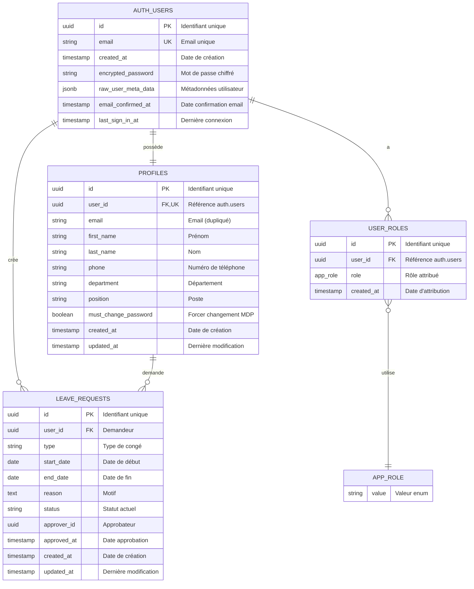
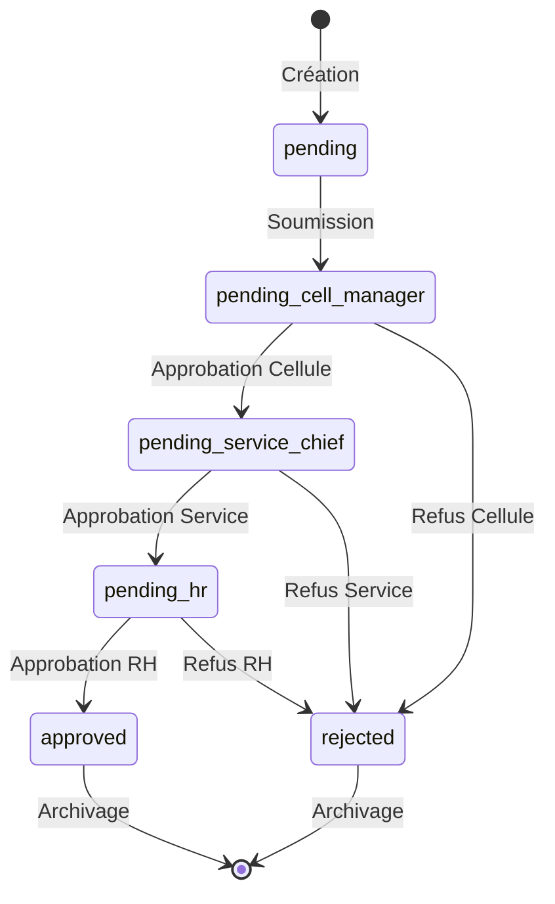
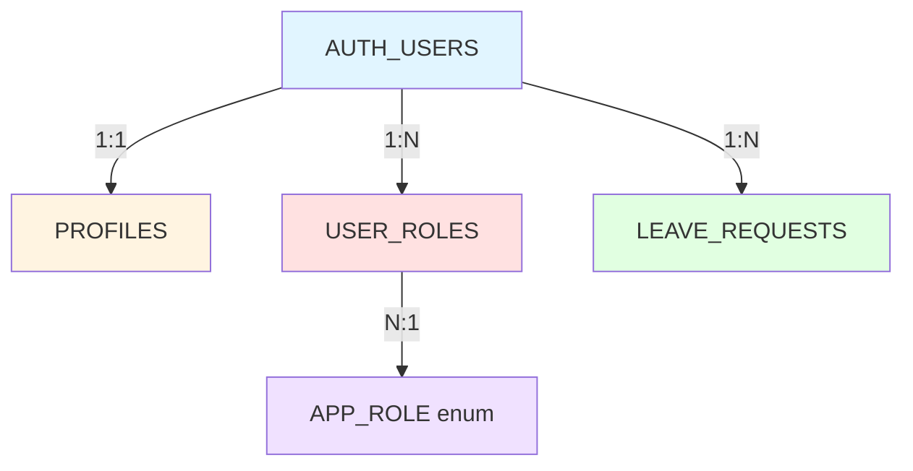

# Modèle Conceptuel de Données (MCD)
## Système de Gestion des Congés

---

## 📊 Vue d'ensemble

Le système de gestion des congés utilise une architecture de base de données relationnelle basée sur PostgreSQL via Supabase. Le modèle suit une séparation claire entre l'authentification (gérée par Supabase Auth) et les données métier (schéma public).

---

## 🔷 Diagramme Entité-Relations Complet



---

## 📋 Description Détaillée des Entités

### 1. AUTH_USERS (Schéma: auth)
**Table système Supabase pour l'authentification**

| Attribut | Type | Contraintes | Description |
|----------|------|-------------|-------------|
| id | UUID | PK | Identifiant unique généré automatiquement |
| email | TEXT | UNIQUE, NOT NULL | Adresse email de connexion |
| encrypted_password | TEXT | NOT NULL | Mot de passe chiffré (bcrypt) |
| email_confirmed_at | TIMESTAMP | NULLABLE | Date de confirmation de l'email |
| created_at | TIMESTAMP | DEFAULT now() | Date de création du compte |
| last_sign_in_at | TIMESTAMP | NULLABLE | Dernière connexion |
| raw_user_meta_data | JSONB | DEFAULT '{}' | Métadonnées personnalisées |

**Fonctionnalités:**
- Gestion automatique par Supabase Auth
- Support de l'authentification par email/mot de passe
- Stockage sécurisé des mots de passe (bcrypt)
- Gestion des sessions JWT

**Sécurité:**
- Table non accessible directement via l'API REST
- Gestion via les fonctions d'authentification Supabase
- Politiques d'authentification configurables

---

### 2. PROFILES (Schéma: public)
**Informations étendues des utilisateurs**

| Attribut | Type | Contraintes | Description |
|----------|------|-------------|-------------|
| id | UUID | PK, DEFAULT gen_random_uuid() | Identifiant unique |
| user_id | UUID | FK → auth.users(id), UNIQUE, NOT NULL | Lien avec l'authentification |
| email | TEXT | NOT NULL | Email (dupliqué pour faciliter les requêtes) |
| first_name | TEXT | NOT NULL | Prénom de l'utilisateur |
| last_name | TEXT | NOT NULL | Nom de famille |
| phone | TEXT | NULLABLE | Numéro de téléphone |
| department | TEXT | NULLABLE | Département/Service |
| position | TEXT | NULLABLE | Fonction/Poste |
| must_change_password | BOOLEAN | DEFAULT true | Forcer le changement de mot de passe |
| created_at | TIMESTAMP | DEFAULT now() | Date de création |
| updated_at | TIMESTAMP | DEFAULT now() | Dernière mise à jour |

**Relations:**
- `user_id` → `auth.users.id` (ON DELETE CASCADE)
- Relation 1:1 avec AUTH_USERS

**Triggers:**
- `update_profiles_updated_at`: Met à jour `updated_at` automatiquement
- `on_auth_user_created`: Crée automatiquement le profil lors de l'inscription

**Index:**
- Index unique sur `user_id`
- Index sur `email` pour les recherches

**Politiques RLS:**
1. **Users can view their own profile** (SELECT)
   - `auth.uid() = user_id`
2. **Users can update their own profile** (UPDATE)
   - `auth.uid() = user_id`
3. **Admins can view all profiles** (SELECT)
   - `has_role(auth.uid(), 'admin')`
4. **Admins can update all profiles** (UPDATE)
   - `has_role(auth.uid(), 'admin')`
5. **Admins can insert profiles** (INSERT)
   - `has_role(auth.uid(), 'admin')`

---

### 3. USER_ROLES (Schéma: public)
**Gestion des rôles et permissions**

| Attribut | Type | Contraintes | Description |
|----------|------|-------------|-------------|
| id | UUID | PK, DEFAULT gen_random_uuid() | Identifiant unique |
| user_id | UUID | FK → auth.users(id), NOT NULL | Utilisateur concerné |
| role | app_role | ENUM, NOT NULL | Rôle attribué |
| created_at | TIMESTAMP | DEFAULT now() | Date d'attribution |

**Contraintes:**
- UNIQUE(user_id, role): Un utilisateur ne peut avoir le même rôle qu'une fois
- FK ON DELETE CASCADE: Suppression des rôles si l'utilisateur est supprimé

**Enum app_role:**
```sql
CREATE TYPE app_role AS ENUM (
  'employee',      -- Employé standard
  'cell_manager',  -- Responsable de cellule
  'service_chief', -- Chef de service
  'hr',           -- Ressources Humaines
  'admin'         -- Administrateur système
);
```

**Hiérarchie des rôles:**
1. **employee**: Rôle de base, peut créer et gérer ses propres demandes
2. **cell_manager**: Valide les demandes de sa cellule (1ère étape)
3. **service_chief**: Valide les demandes de son service (2ème étape)
4. **hr**: Validation finale des demandes (3ème étape)
5. **admin**: Accès complet au système, gestion des utilisateurs

**Relations:**
- `user_id` → `auth.users.id` (ON DELETE CASCADE)
- Relation N:M entre utilisateurs et rôles via cette table

**Politiques RLS:**
1. **Users can view their own roles** (SELECT)
   - `auth.uid() = user_id`
2. **Admins can manage all roles** (ALL)
   - `has_role(auth.uid(), 'admin')`

---

### 4. LEAVE_REQUESTS (Schéma: public)
**Demandes de congés et workflow d'approbation**

| Attribut | Type | Contraintes | Description |
|----------|------|-------------|-------------|
| id | UUID | PK, DEFAULT gen_random_uuid() | Identifiant unique |
| user_id | UUID | FK → auth.users(id), NOT NULL | Demandeur |
| type | TEXT | NOT NULL | Type de congé (annuel, maladie, etc.) |
| start_date | DATE | NOT NULL | Date de début du congé |
| end_date | DATE | NOT NULL | Date de fin du congé |
| reason | TEXT | NULLABLE | Motif/Justification |
| status | TEXT | DEFAULT 'pending' | Statut actuel dans le workflow |
| approver_id | UUID | NULLABLE | ID du dernier approbateur |
| approved_at | TIMESTAMP | NULLABLE | Date de dernière validation |
| created_at | TIMESTAMP | DEFAULT now() | Date de création |
| updated_at | TIMESTAMP | DEFAULT now() | Dernière modification |

**Types de congés:**
- Congé annuel
- Congé maladie
- Congé sans solde
- Congé formation
- Congé exceptionnel
- Congé maternité/paternité

**États possibles (status):**



| Statut | Description | Acteur concerné |
|--------|-------------|-----------------|
| pending | En attente de soumission | Employé |
| pending_cell_manager | En attente validation 1 | Responsable de cellule |
| pending_service_chief | En attente validation 2 | Chef de service |
| pending_hr | En attente validation finale | RH |
| approved | Validé | - |
| rejected | Rejeté | - |

**Relations:**
- `user_id` → `auth.users.id` (ON DELETE CASCADE)
- `approver_id` → `auth.users.id` (ON DELETE SET NULL)

**Triggers:**
- `update_leave_requests_updated_at`: Met à jour `updated_at` automatiquement

**Contraintes métier:**
- `start_date` <= `end_date`
- Pas de chevauchement de dates pour un même utilisateur
- Validation selon la hiérarchie des rôles

**Politiques RLS:**
1. **Users can view their own requests** (SELECT)
   - `auth.uid() = user_id`
2. **Users can create their own requests** (INSERT)
   - `auth.uid() = user_id`
3. **Users can update their pending requests** (UPDATE)
   - `auth.uid() = user_id AND status = 'pending'`
4. **Managers can view team requests** (SELECT)
   - `has_role(auth.uid(), 'cell_manager')` OR
   - `has_role(auth.uid(), 'service_chief')` OR
   - `has_role(auth.uid(), 'hr')` OR
   - `has_role(auth.uid(), 'admin')`
5. **Managers can update requests** (UPDATE)
   - Même condition que pour la consultation

---

## 🔗 Relations et Cardinalités

### Schéma des relations



### Description détaillée

#### 1. AUTH_USERS ↔ PROFILES (1:1)
**Type:** Relation un-à-un obligatoire

**Description:** Chaque utilisateur authentifié possède exactement un profil.

**Implémentation:**
- Clé étrangère: `profiles.user_id` → `auth.users.id`
- Contrainte: UNIQUE sur `user_id`
- CASCADE: ON DELETE CASCADE

**Trigger associé:**
```sql
CREATE TRIGGER on_auth_user_created
  AFTER INSERT ON auth.users
  FOR EACH ROW 
  EXECUTE FUNCTION handle_new_user();
```

**Cas d'usage:**
- Création automatique du profil lors de l'inscription
- Synchronisation des données utilisateur
- Enrichissement des informations d'authentification

---

#### 2. AUTH_USERS ↔ USER_ROLES (1:N)
**Type:** Relation un-à-plusieurs

**Description:** Un utilisateur peut avoir plusieurs rôles simultanément (multi-roles).

**Implémentation:**
- Clé étrangère: `user_roles.user_id` → `auth.users.id`
- Contrainte: UNIQUE(user_id, role)
- CASCADE: ON DELETE CASCADE

**Exemple:**
```sql
-- Un utilisateur peut être à la fois cell_manager et service_chief
INSERT INTO user_roles (user_id, role) VALUES 
  ('uuid-user', 'cell_manager'),
  ('uuid-user', 'service_chief');
```

**Règles métier:**
- Un utilisateur ne peut pas avoir le même rôle en double
- La suppression d'un utilisateur supprime tous ses rôles
- Les rôles sont cumulatifs (non exclusifs)

---

#### 3. AUTH_USERS ↔ LEAVE_REQUESTS (1:N) 
**Type:** Relation un-à-plusieurs (demandeur)

**Description:** Un utilisateur peut créer plusieurs demandes de congés.

**Implémentation:**
- Clé étrangère: `leave_requests.user_id` → `auth.users.id`
- CASCADE: ON DELETE CASCADE

**Relations supplémentaires:**
- `approver_id` → `auth.users.id` (SET NULL on delete)
- Permet de tracer qui a validé/rejeté une demande

**Règles métier:**
- Un employé peut avoir plusieurs demandes en cours
- Pas de chevauchement de dates autorisé
- Historique complet des demandes conservé

---

#### 4. USER_ROLES ↔ APP_ROLE (N:1)
**Type:** Relation plusieurs-à-un avec énumération

**Description:** Chaque attribution de rôle référence un type de rôle défini.

**Implémentation:**
```sql
CREATE TYPE app_role AS ENUM (
  'employee', 'cell_manager', 'service_chief', 'hr', 'admin'
);
```

**Validation:**
- Type énuméré garantit l'intégrité référentielle
- Impossible d'insérer un rôle non défini
- Performance optimisée (stockage en entier)

---

## ⚙️ Fonctions de Base de Données

### 1. has_role(_user_id UUID, _role app_role) → BOOLEAN
**Type:** SECURITY DEFINER (Droits élevés)

**Description:** Vérifie si un utilisateur possède un rôle spécifique.

**Code SQL:**
```sql
CREATE OR REPLACE FUNCTION public.has_role(_user_id uuid, _role app_role)
RETURNS boolean
LANGUAGE sql
STABLE
SECURITY DEFINER
SET search_path = public
AS $$
  SELECT EXISTS (
    SELECT 1
    FROM public.user_roles
    WHERE user_id = _user_id
      AND role = _role
  )
$$;
```

**Utilisation:**
```sql
-- Dans les politiques RLS
SELECT * FROM profiles WHERE has_role(auth.uid(), 'admin');

-- Dans les requêtes applicatives
SELECT has_role('uuid-user', 'hr'); -- Retourne true/false
```

**Caractéristiques:**
- `STABLE`: Résultat constant pour mêmes paramètres dans une transaction
- `SECURITY DEFINER`: Exécuté avec les privilèges du créateur (évite la récursion RLS)
- Performance: Utilise EXISTS pour optimisation

---

### 2. get_user_roles(_user_id UUID) → SETOF app_role
**Type:** SECURITY DEFINER

**Description:** Retourne l'ensemble des rôles d'un utilisateur.

**Code SQL:**
```sql
CREATE OR REPLACE FUNCTION public.get_user_roles(_user_id uuid)
RETURNS SETOF app_role
LANGUAGE sql
STABLE
SECURITY DEFINER
AS $$
  SELECT role
  FROM public.user_roles
  WHERE user_id = _user_id
$$;
```

**Utilisation:**
```sql
-- Récupérer tous les rôles d'un utilisateur
SELECT * FROM get_user_roles('uuid-user');
-- Retourne: ['employee', 'cell_manager']

-- Vérifier la présence d'un rôle spécifique
SELECT 'admin' = ANY(ARRAY(SELECT get_user_roles('uuid-user')));
```

**Cas d'usage:**
- Affichage des permissions utilisateur
- Construction des menus dynamiques
- Journalisation des accès

---

### 3. handle_new_user() → TRIGGER
**Type:** TRIGGER FUNCTION (SECURITY DEFINER)

**Description:** Crée automatiquement un profil lors de l'inscription d'un utilisateur.

**Code SQL:**
```sql
CREATE OR REPLACE FUNCTION public.handle_new_user()
RETURNS trigger
LANGUAGE plpgsql
SECURITY DEFINER
SET search_path TO ''
AS $$
BEGIN
  INSERT INTO public.profiles (user_id, email, first_name, last_name)
  VALUES (
    new.id, 
    new.email,
    COALESCE(new.raw_user_meta_data ->> 'first_name', ''),
    COALESCE(new.raw_user_meta_data ->> 'last_name', '')
  );
  RETURN new;
END;
$$;

-- Trigger associé
CREATE TRIGGER on_auth_user_created
  AFTER INSERT ON auth.users
  FOR EACH ROW 
  EXECUTE FUNCTION handle_new_user();
```

**Flux d'exécution:**
1. Utilisateur s'inscrit via Supabase Auth
2. Nouveau record créé dans `auth.users`
3. Trigger `on_auth_user_created` déclenché
4. Fonction `handle_new_user()` crée le profil
5. Extraction des métadonnées (prénom, nom)

**Sécurité:**
- `SECURITY DEFINER`: Nécessaire pour écrire dans `public.profiles`
- `SET search_path TO ''`: Protection contre les injections de schéma

---

### 4. update_updated_at_column() → TRIGGER
**Type:** TRIGGER FUNCTION

**Description:** Met à jour automatiquement le champ `updated_at` lors d'une modification.

**Code SQL:**
```sql
CREATE OR REPLACE FUNCTION public.update_updated_at_column()
RETURNS trigger
LANGUAGE plpgsql
AS $$
BEGIN
  NEW.updated_at = now();
  RETURN NEW;
END;
$$;

-- Application aux tables
CREATE TRIGGER update_profiles_updated_at
  BEFORE UPDATE ON public.profiles
  FOR EACH ROW
  EXECUTE FUNCTION update_updated_at_column();

CREATE TRIGGER update_leave_requests_updated_at
  BEFORE UPDATE ON public.leave_requests
  FOR EACH ROW
  EXECUTE FUNCTION update_updated_at_column();
```

**Avantages:**
- Suivi automatique des modifications
- Cohérence des timestamps
- Pas de gestion manuelle dans le code

---

## 🔒 Sécurité et Row Level Security (RLS)

### Principe général

Toutes les tables du schéma `public` ont **Row Level Security (RLS)** activé :
```sql
ALTER TABLE public.profiles ENABLE ROW LEVEL SECURITY;
ALTER TABLE public.user_roles ENABLE ROW LEVEL SECURITY;
ALTER TABLE public.leave_requests ENABLE ROW LEVEL SECURITY;
```

### Matrice de contrôle d'accès

| Table | Rôle | SELECT | INSERT | UPDATE | DELETE |
|-------|------|--------|--------|--------|--------|
| **profiles** | Propriétaire | ✅ Self | ❌ | ✅ Self | ❌ |
| | Admin | ✅ All | ✅ All | ✅ All | ❌ |
| **user_roles** | Propriétaire | ✅ Self | ❌ | ❌ | ❌ |
| | Admin | ✅ All | ✅ All | ✅ All | ✅ All |
| **leave_requests** | Employee | ✅ Self | ✅ Self | ✅ Pending | ❌ |
| | Manager | ✅ Team | ❌ | ✅ Status | ❌ |
| | Admin | ✅ All | ❌ | ✅ All | ❌ |

### Politiques RLS détaillées

#### PROFILES

```sql
-- Lecture : Utilisateurs voient leur profil
CREATE POLICY "Users can view their own profile" 
ON public.profiles FOR SELECT
USING (auth.uid() = user_id);

-- Lecture : Admins voient tous les profils
CREATE POLICY "Admins can view all profiles" 
ON public.profiles FOR SELECT
USING (has_role(auth.uid(), 'admin'));

-- Modification : Utilisateurs modifient leur profil
CREATE POLICY "Users can update their own profile" 
ON public.profiles FOR UPDATE
USING (auth.uid() = user_id);

-- Modification : Admins modifient tous les profils
CREATE POLICY "Admins can update all profiles" 
ON public.profiles FOR UPDATE
USING (has_role(auth.uid(), 'admin'));

-- Création : Seuls les admins créent des profils
CREATE POLICY "Admins can insert profiles" 
ON public.profiles FOR INSERT
WITH CHECK (has_role(auth.uid(), 'admin'));
```

#### USER_ROLES

```sql
-- Lecture : Utilisateurs voient leurs rôles
CREATE POLICY "Users can view their own roles" 
ON public.user_roles FOR SELECT
USING (auth.uid() = user_id);

-- Gestion complète : Admins gèrent tous les rôles
CREATE POLICY "Admins can manage all roles" 
ON public.user_roles FOR ALL
USING (has_role(auth.uid(), 'admin'));
```

#### LEAVE_REQUESTS

```sql
-- Lecture : Employés voient leurs demandes
CREATE POLICY "Users can view their own requests" 
ON public.leave_requests FOR SELECT
USING (auth.uid() = user_id);

-- Lecture : Managers voient les demandes de leur périmètre
CREATE POLICY "Managers can view team requests" 
ON public.leave_requests FOR SELECT
USING (
  has_role(auth.uid(), 'admin') OR
  has_role(auth.uid(), 'hr') OR
  has_role(auth.uid(), 'service_chief') OR
  has_role(auth.uid(), 'cell_manager')
);

-- Création : Employés créent leurs demandes
CREATE POLICY "Users can create their own requests" 
ON public.leave_requests FOR INSERT
WITH CHECK (auth.uid() = user_id);

-- Modification : Employés modifient leurs demandes en attente
CREATE POLICY "Users can update their pending requests" 
ON public.leave_requests FOR UPDATE
USING (auth.uid() = user_id AND status = 'pending');

-- Modification : Managers modifient les demandes
CREATE POLICY "Managers can update requests" 
ON public.leave_requests FOR UPDATE
USING (
  has_role(auth.uid(), 'admin') OR
  has_role(auth.uid(), 'hr') OR
  has_role(auth.uid(), 'service_chief') OR
  has_role(auth.uid(), 'cell_manager')
);
```

### Bonnes pratiques de sécurité

1. **Utilisation de SECURITY DEFINER**
   - Évite la récursion infinie dans les politiques RLS
   - Centralise la logique de vérification des rôles

2. **Validation côté serveur**
   - Les politiques RLS sont la dernière ligne de défense
   - Validation métier dans les Edge Functions

3. **Principe du moindre privilège**
   - Aucune suppression directe (DELETE) autorisée
   - Soft delete via champ `deleted_at` si nécessaire

4. **Traçabilité**
   - Champs `created_at` et `updated_at` automatiques
   - Conservation de l'`approver_id` dans les demandes

---

## 📊 Contraintes d'intégrité

### Contraintes de clés primaires
```sql
ALTER TABLE profiles ADD PRIMARY KEY (id);
ALTER TABLE user_roles ADD PRIMARY KEY (id);
ALTER TABLE leave_requests ADD PRIMARY KEY (id);
```

### Contraintes d'unicité
```sql
-- Un utilisateur = un profil
ALTER TABLE profiles ADD UNIQUE (user_id);

-- Un utilisateur ne peut pas avoir le même rôle en double
ALTER TABLE user_roles ADD UNIQUE (user_id, role);
```

### Contraintes de clés étrangères
```sql
-- Profils liés aux utilisateurs
ALTER TABLE profiles 
  ADD FOREIGN KEY (user_id) 
  REFERENCES auth.users(id) 
  ON DELETE CASCADE;

-- Rôles liés aux utilisateurs
ALTER TABLE user_roles 
  ADD FOREIGN KEY (user_id) 
  REFERENCES auth.users(id) 
  ON DELETE CASCADE;

-- Demandes liées aux utilisateurs
ALTER TABLE leave_requests 
  ADD FOREIGN KEY (user_id) 
  REFERENCES auth.users(id) 
  ON DELETE CASCADE;

ALTER TABLE leave_requests 
  ADD FOREIGN KEY (approver_id) 
  REFERENCES auth.users(id) 
  ON DELETE SET NULL;
```

### Contraintes métier (CHECK)
```sql
-- Dates cohérentes
ALTER TABLE leave_requests 
  ADD CONSTRAINT check_dates 
  CHECK (start_date <= end_date);

-- Statuts valides
ALTER TABLE leave_requests 
  ADD CONSTRAINT check_status 
  CHECK (status IN (
    'pending',
    'pending_cell_manager',
    'pending_service_chief',
    'pending_hr',
    'approved',
    'rejected'
  ));
```

---

## 🔍 Index et Optimisations

### Index existants
```sql
-- Index de clé primaire (automatiques)
CREATE UNIQUE INDEX profiles_pkey ON profiles(id);
CREATE UNIQUE INDEX user_roles_pkey ON user_roles(id);
CREATE UNIQUE INDEX leave_requests_pkey ON leave_requests(id);

-- Index d'unicité
CREATE UNIQUE INDEX profiles_user_id_key ON profiles(user_id);
CREATE UNIQUE INDEX user_roles_user_id_role_key ON user_roles(user_id, role);

-- Index de clés étrangères (pour les jointures)
CREATE INDEX idx_profiles_user_id ON profiles(user_id);
CREATE INDEX idx_user_roles_user_id ON user_roles(user_id);
CREATE INDEX idx_leave_requests_user_id ON leave_requests(user_id);
CREATE INDEX idx_leave_requests_approver_id ON leave_requests(approver_id);
```

### Index recommandés pour les performances
```sql
-- Recherche par statut de demande
CREATE INDEX idx_leave_requests_status ON leave_requests(status);

-- Recherche par plage de dates
CREATE INDEX idx_leave_requests_dates ON leave_requests(start_date, end_date);

-- Recherche combinée (statut + utilisateur)
CREATE INDEX idx_leave_requests_user_status ON leave_requests(user_id, status);

-- Recherche par email dans les profils
CREATE INDEX idx_profiles_email ON profiles(email);

-- Recherche par département
CREATE INDEX idx_profiles_department ON profiles(department);
```

### Statistiques des tables
```sql
-- Mise à jour des statistiques pour l'optimiseur
ANALYZE profiles;
ANALYZE user_roles;
ANALYZE leave_requests;
```

---

## 📈 Schéma de données complet (SQL DDL)

```sql
-- =======================
-- ÉNUMÉRATIONS
-- =======================

CREATE TYPE app_role AS ENUM (
  'employee',
  'cell_manager',
  'service_chief',
  'hr',
  'admin'
);

-- =======================
-- TABLES
-- =======================

-- Table PROFILES
CREATE TABLE public.profiles (
  id UUID PRIMARY KEY DEFAULT gen_random_uuid(),
  user_id UUID NOT NULL UNIQUE REFERENCES auth.users(id) ON DELETE CASCADE,
  email TEXT NOT NULL,
  first_name TEXT NOT NULL,
  last_name TEXT NOT NULL,
  phone TEXT,
  department TEXT,
  position TEXT,
  must_change_password BOOLEAN DEFAULT true,
  created_at TIMESTAMP WITH TIME ZONE DEFAULT now(),
  updated_at TIMESTAMP WITH TIME ZONE DEFAULT now()
);

-- Table USER_ROLES
CREATE TABLE public.user_roles (
  id UUID PRIMARY KEY DEFAULT gen_random_uuid(),
  user_id UUID NOT NULL REFERENCES auth.users(id) ON DELETE CASCADE,
  role app_role NOT NULL,
  created_at TIMESTAMP WITH TIME ZONE DEFAULT now(),
  UNIQUE(user_id, role)
);

-- Table LEAVE_REQUESTS
CREATE TABLE public.leave_requests (
  id UUID PRIMARY KEY DEFAULT gen_random_uuid(),
  user_id UUID NOT NULL REFERENCES auth.users(id) ON DELETE CASCADE,
  type TEXT NOT NULL,
  start_date DATE NOT NULL,
  end_date DATE NOT NULL,
  reason TEXT,
  status TEXT DEFAULT 'pending',
  approver_id UUID REFERENCES auth.users(id) ON DELETE SET NULL,
  approved_at TIMESTAMP WITH TIME ZONE,
  created_at TIMESTAMP WITH TIME ZONE DEFAULT now(),
  updated_at TIMESTAMP WITH TIME ZONE DEFAULT now(),
  CONSTRAINT check_dates CHECK (start_date <= end_date)
);

-- =======================
-- ROW LEVEL SECURITY
-- =======================

ALTER TABLE public.profiles ENABLE ROW LEVEL SECURITY;
ALTER TABLE public.user_roles ENABLE ROW LEVEL SECURITY;
ALTER TABLE public.leave_requests ENABLE ROW LEVEL SECURITY;

-- [Politiques RLS détaillées dans la section précédente]

-- =======================
-- FONCTIONS
-- =======================

-- [Fonctions détaillées dans la section précédente]

-- =======================
-- TRIGGERS
-- =======================

CREATE TRIGGER on_auth_user_created
  AFTER INSERT ON auth.users
  FOR EACH ROW 
  EXECUTE FUNCTION handle_new_user();

CREATE TRIGGER update_profiles_updated_at
  BEFORE UPDATE ON public.profiles
  FOR EACH ROW
  EXECUTE FUNCTION update_updated_at_column();

CREATE TRIGGER update_leave_requests_updated_at
  BEFORE UPDATE ON public.leave_requests
  FOR EACH ROW
  EXECUTE FUNCTION update_updated_at_column();
```

---

## 📝 Résumé et Conclusion

### Points clés du modèle

1. **Architecture à 3 couches:**
   - Authentification (auth.users)
   - Profils utilisateurs (public.profiles)
   - Données métier (public.leave_requests)

2. **Sécurité multi-niveaux:**
   - RLS sur toutes les tables publiques
   - Fonctions SECURITY DEFINER
   - Validation des rôles centralisée

3. **Flexibilité des rôles:**
   - Multi-rôles par utilisateur
   - Hiérarchie d'approbation
   - Extension facile (ajout de nouveaux rôles)

4. **Intégrité des données:**
   - Contraintes FK CASCADE
   - Triggers automatiques
   - Validation des dates et statuts

5. **Performance:**
   - Index optimisés
   - Fonctions STABLE
   - Requêtes efficaces avec EXISTS

### Évolutions futures possibles

- **Notifications:** Table pour les alertes et notifications
- **Historique:** Table d'audit des modifications
- **Documents:** Gestion des pièces jointes (certificats médicaux)
- **Calendrier:** Vue des absences par équipe/service
- **Statistiques:** Tables agrégées pour les rapports
- **Workflow personnalisé:** Configuration dynamique des étapes d'approbation

---

**Document généré pour:** Mémoire technique  
**Version:** 1.0  
**Date:** 2025  
**Système:** Application de Gestion des Congés
