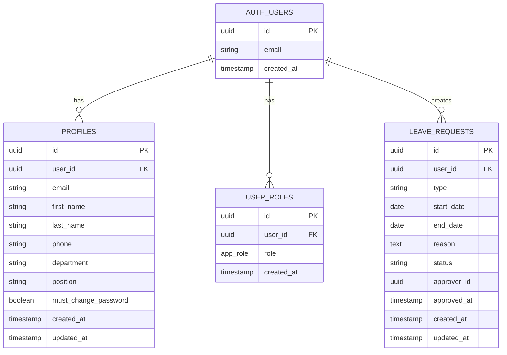

# Modèle Conceptuel de Données (MCD)

## Diagramme Entité-Relations

## Description des Entités

### AUTH_USERS (Gérée par Supabase Auth)
- Table système de Supabase pour l'authentification
- Contient les identifiants et informations de connexion

### PROFILES
- **Clé primaire**: `id` (UUID)
- **Clé étrangère**: `user_id` → `auth.users.id`
- Informations personnelles et professionnelles des utilisateurs
- Chaque utilisateur a un profil unique

### USER_ROLES
- **Clé primaire**: `id` (UUID)
- **Clé étrangère**: `user_id` → `auth.users.id`
- **Contrainte unique**: (user_id, role)
- Gestion des rôles multiples par utilisateur
- Rôles disponibles (enum `app_role`):
  - `employee` - Employé
  - `cell_manager` - Responsable de cellule
  - `service_chief` - Chef de service
  - `hr` - Ressources Humaines
  - `admin` - Administrateur

### LEAVE_REQUESTS
- **Clé primaire**: `id` (UUID)
- **Clé étrangère**: `user_id` → `auth.users.id`
- Demandes de congés des utilisateurs
- États possibles:
  - `pending` - En attente
  - `pending_cell_manager` - En attente du responsable de cellule
  - `pending_service_chief` - En attente du chef de service
  - `pending_hr` - En attente des RH
  - `approved` - Approuvé
  - `rejected` - Rejeté

## Relations

1. **AUTH_USERS → PROFILES** (1:1)
   - Un utilisateur authentifié possède un profil unique
   - Suppression en cascade

2. **AUTH_USERS → USER_ROLES** (1:N)
   - Un utilisateur peut avoir plusieurs rôles
   - Suppression en cascade

3. **AUTH_USERS → LEAVE_REQUESTS** (1:N)
   - Un utilisateur peut créer plusieurs demandes de congés
   - `user_id` identifie le demandeur
   - `approver_id` identifie l'approbateur (optionnel)

## Fonctions de Base de Données

### has_role(user_id, role)
- Vérifie si un utilisateur possède un rôle spécifique
- Utilisée dans les politiques RLS

### get_user_roles(user_id)
- Retourne tous les rôles d'un utilisateur

### handle_new_user()
- Trigger automatique lors de la création d'un utilisateur
- Crée automatiquement le profil associé

### update_updated_at_column()
- Trigger pour mettre à jour automatiquement le champ `updated_at`

## Sécurité (RLS)

Toutes les tables ont Row Level Security (RLS) activé avec des politiques spécifiques:

- **PROFILES**: Les utilisateurs peuvent voir/modifier leur propre profil, les admins peuvent tout gérer
- **USER_ROLES**: Les utilisateurs peuvent voir leurs rôles, seuls les admins peuvent les modifier
- **LEAVE_REQUESTS**: Les utilisateurs gèrent leurs demandes, les managers voient les demandes de leur équipe
