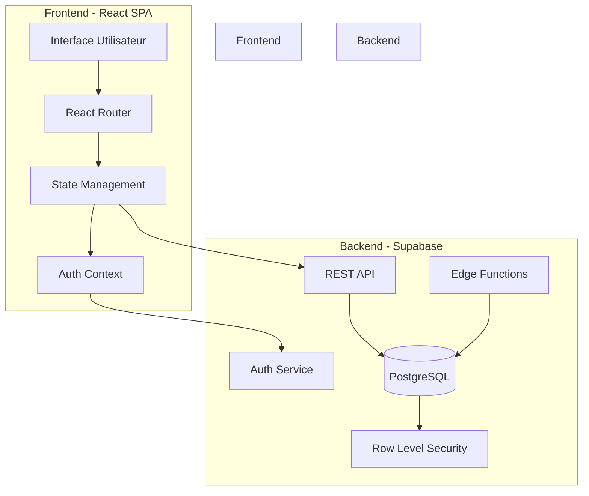
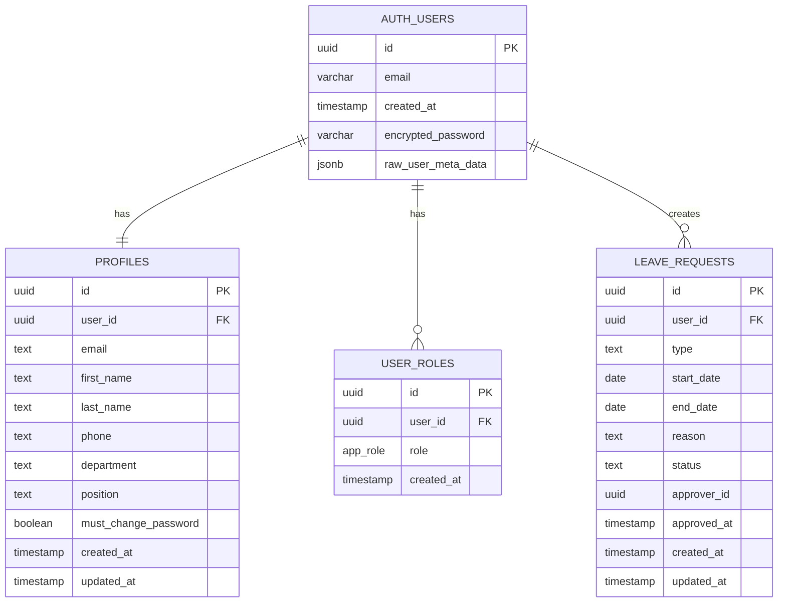
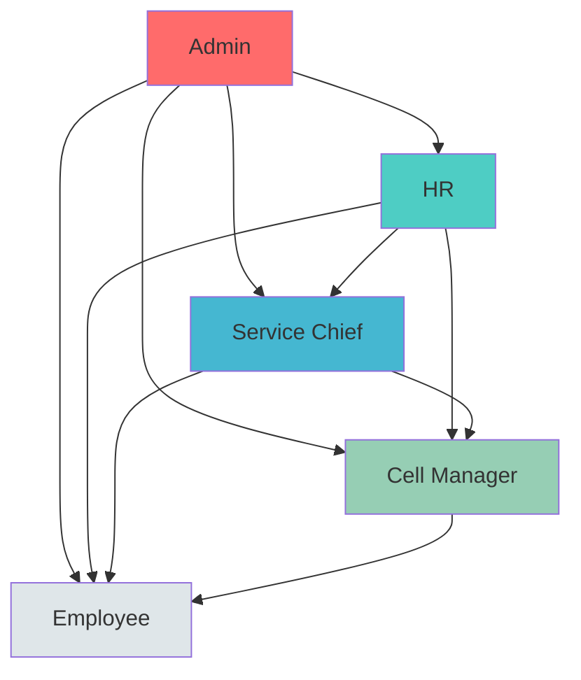
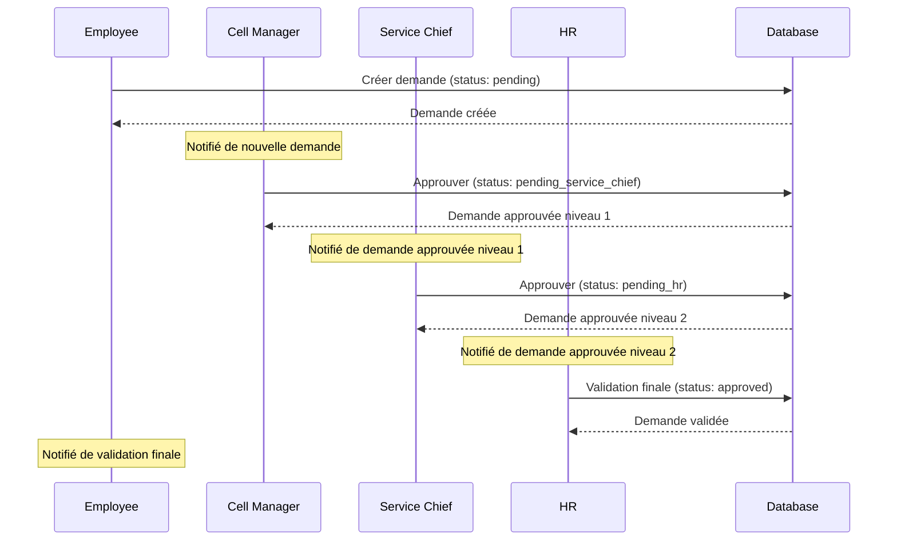
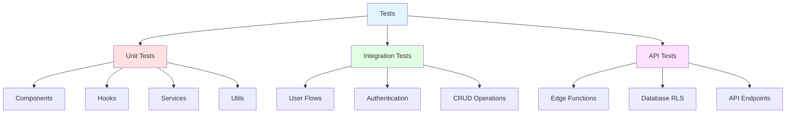

# Documentation Technique - Système de Gestion des Congés

## Table des Matières

1. [Vue d'ensemble](#vue-densemble)
2. [Architecture](#architecture)
3. [Stack Technologique](#stack-technologique)
4. [Schéma de Base de Données](#schéma-de-base-de-données)
5. [Système de Rôles et Permissions](#système-de-rôles-et-permissions)
6. [Workflow d'Approbation](#workflow-dapprobation)
7. [APIs et Intégrations](#apis-et-intégrations)
8. [Sécurité](#sécurité)
9. [Structure du Projet](#structure-du-projet)
10. [Tests](#tests)
11. [Déploiement](#déploiement)
12. [Maintenance](#maintenance)

---

## Vue d'ensemble

### Description
Système de gestion des congés avec workflow d'approbation hiérarchique permettant aux employés de soumettre des demandes de congés et aux managers de les approuver selon leur niveau de responsabilité.

### Fonctionnalités Principales
- **Authentification sécurisée** avec gestion des sessions
- **Gestion des profils utilisateurs** avec informations personnelles et professionnelles
- **Système de rôles hiérarchique** (Employee, Cell Manager, Service Chief, HR, Admin)
- **Workflow d'approbation multi-niveaux** pour les demandes de congés
- **Tableau de bord personnalisé** selon le rôle de l'utilisateur
- **Notifications en temps réel** pour les changements de statut
- **Rapports et statistiques** pour les managers et RH
- **Administration des utilisateurs** pour les administrateurs

### Acteurs du Système

| Rôle | Responsabilités | Niveau d'accès |
|------|----------------|----------------|
| **Employee** | Soumet et consulte ses demandes de congés | Données personnelles uniquement |
| **Cell Manager** | Approuve les demandes de son équipe (1er niveau) | Données de l'équipe |
| **Service Chief** | Approuve les demandes du service (2ème niveau) | Données du service |
| **HR** | Validation finale et gestion administrative | Toutes les données |
| **Admin** | Gestion complète du système et des utilisateurs | Accès total |

---

## Architecture

### Architecture Globale



### Principes Architecturaux

1. **Single Page Application (SPA)**: Interface React avec routing côté client
2. **Backend-as-a-Service (BaaS)**: Supabase pour la gestion backend
3. **Serverless**: Edge Functions pour la logique métier côté serveur
4. **Real-time**: Mises à jour en temps réel via Supabase subscriptions
5. **Security by Design**: RLS policies pour la sécurité au niveau base de données

---

## Stack Technologique

### Frontend

| Technologie | Version | Usage |
|------------|---------|-------|
| **React** | ^18.3.1 | Framework UI principal |
| **TypeScript** | Latest | Typage statique |
| **Vite** | Latest | Build tool & dev server |
| **Tailwind CSS** | Latest | Framework CSS utility-first |
| **shadcn/ui** | Latest | Composants UI réutilisables |
| **React Router DOM** | ^6.26.2 | Routing côté client |
| **React Hook Form** | ^7.53.0 | Gestion des formulaires |
| **React Query** | ^5.56.2 | Data fetching & caching |
| **Zod** | ^3.23.8 | Validation de schémas |
| **Lucide React** | ^0.462.0 | Icônes |
| **date-fns** | ^3.6.0 | Manipulation des dates |
| **Recharts** | ^2.12.7 | Graphiques et visualisations |

### Backend (Supabase)

| Composant | Technologie | Usage |
|-----------|------------|-------|
| **Database** | PostgreSQL 15+ | Base de données relationnelle |
| **Authentication** | Supabase Auth | Gestion des utilisateurs et sessions |
| **Real-time** | Supabase Realtime | Synchronisation temps réel |
| **Edge Functions** | Deno | Logique serveur serverless |
| **Row Level Security** | PostgreSQL RLS | Sécurité au niveau données |

### Outils de Développement

| Outil | Usage |
|-------|-------|
| **Vitest** | Tests unitaires et d'intégration |
| **Testing Library** | Tests des composants React |
| **ESLint** | Linting du code |
| **Postman** | Tests API |

---

## Schéma de Base de Données

### Modèle Conceptuel de Données (MCD)



### Tables Détaillées

#### 1. profiles (public.profiles)

Stocke les informations personnelles et professionnelles des utilisateurs.

| Colonne | Type | Contraintes | Description |
|---------|------|-------------|-------------|
| id | UUID | PK, DEFAULT gen_random_uuid() | Identifiant unique |
| user_id | UUID | NOT NULL, UNIQUE | Référence vers auth.users |
| email | TEXT | NOT NULL | Email de l'utilisateur |
| first_name | TEXT | NOT NULL | Prénom |
| last_name | TEXT | NOT NULL | Nom |
| phone | TEXT | NULLABLE | Numéro de téléphone |
| department | TEXT | NULLABLE | Département |
| position | TEXT | NULLABLE | Poste |
| must_change_password | BOOLEAN | DEFAULT true | Force le changement de mot de passe |
| created_at | TIMESTAMP | DEFAULT now() | Date de création |
| updated_at | TIMESTAMP | DEFAULT now() | Date de modification |

**Trigger**: `update_profiles_updated_at` - Met à jour automatiquement `updated_at`

#### 2. user_roles (public.user_roles)

Gère les rôles multiples des utilisateurs.

| Colonne | Type | Contraintes | Description |
|---------|------|-------------|-------------|
| id | UUID | PK, DEFAULT gen_random_uuid() | Identifiant unique |
| user_id | UUID | NOT NULL | Référence vers auth.users |
| role | app_role | NOT NULL | Rôle de l'utilisateur |
| created_at | TIMESTAMP | DEFAULT now() | Date de création |

**Contrainte**: UNIQUE (user_id, role) - Un utilisateur ne peut avoir le même rôle qu'une fois

**Enum app_role**: 
- `employee` - Employé standard
- `cell_manager` - Responsable de cellule
- `service_chief` - Chef de service
- `hr` - Ressources humaines
- `admin` - Administrateur système

#### 3. leave_requests (public.leave_requests)

Stocke les demandes de congés avec leur statut d'approbation.

| Colonne | Type | Contraintes | Description |
|---------|------|-------------|-------------|
| id | UUID | PK, DEFAULT gen_random_uuid() | Identifiant unique |
| user_id | UUID | NOT NULL | Référence vers auth.users |
| type | TEXT | NOT NULL | Type de congé |
| start_date | DATE | NOT NULL | Date de début |
| end_date | DATE | NOT NULL | Date de fin |
| reason | TEXT | NULLABLE | Raison de la demande |
| status | TEXT | DEFAULT 'pending' | Statut de la demande |
| approver_id | UUID | NULLABLE | ID de l'approbateur |
| approved_at | TIMESTAMP | NULLABLE | Date d'approbation |
| created_at | TIMESTAMP | DEFAULT now() | Date de création |
| updated_at | TIMESTAMP | DEFAULT now() | Date de modification |

**Statuts possibles**:
- `pending` - En attente (initial)
- `pending_cell_manager` - En attente approbation responsable cellule
- `pending_service_chief` - En attente approbation chef service
- `pending_hr` - En attente validation RH
- `approved` - Approuvée (final)
- `rejected` - Rejetée (final)

**Trigger**: `update_leave_requests_updated_at` - Met à jour automatiquement `updated_at`

### Fonctions de Base de Données

#### 1. has_role(_user_id UUID, _role app_role)

Vérifie si un utilisateur possède un rôle spécifique.

```sql
CREATE OR REPLACE FUNCTION public.has_role(_user_id uuid, _role app_role)
RETURNS boolean
LANGUAGE sql
STABLE SECURITY DEFINER
AS $$
  SELECT EXISTS (
    SELECT 1
    FROM public.user_roles
    WHERE user_id = _user_id
    AND role = _role
  )
$$;
```

**Utilisation**: Utilisée dans les RLS policies pour vérifier les permissions

#### 2. get_user_roles(_user_id UUID)

Retourne tous les rôles d'un utilisateur.

```sql
CREATE OR REPLACE FUNCTION public.get_user_roles(_user_id uuid)
RETURNS SETOF app_role
LANGUAGE sql
STABLE SECURITY DEFINER
AS $$
  SELECT role
  FROM public.user_roles
  WHERE user_id = _user_id
$$;
```

#### 3. handle_new_user()

Crée automatiquement un profil lors de l'inscription d'un utilisateur.

```sql
CREATE OR REPLACE FUNCTION public.handle_new_user()
RETURNS trigger
LANGUAGE plpgsql
SECURITY DEFINER
SET search_path TO ''
AS $$
BEGIN
  INSERT INTO public.profiles (user_id, email, first_name, last_name)
  VALUES (
    new.id, 
    new.email,
    COALESCE(new.raw_user_meta_data ->> 'first_name', ''),
    COALESCE(new.raw_user_meta_data ->> 'last_name', '')
  );
  RETURN new;
END;
$$;
```

**Trigger**: Déclenché automatiquement sur `INSERT` dans `auth.users`

#### 4. update_updated_at_column()

Met à jour automatiquement le champ `updated_at`.

```sql
CREATE OR REPLACE FUNCTION public.update_updated_at_column()
RETURNS trigger
LANGUAGE plpgsql
AS $$
BEGIN
  NEW.updated_at = now();
  RETURN NEW;
END;
$$;
```

---

## Système de Rôles et Permissions

### Hiérarchie des Rôles



### Matrice des Permissions

| Fonctionnalité | Employee | Cell Manager | Service Chief | HR | Admin |
|----------------|----------|--------------|---------------|-----|-------|
| **Authentification** |
| Se connecter | ✅ | ✅ | ✅ | ✅ | ✅ |
| Changer son mot de passe | ✅ | ✅ | ✅ | ✅ | ✅ |
| **Profil** |
| Consulter son profil | ✅ | ✅ | ✅ | ✅ | ✅ |
| Modifier son profil | ✅ | ✅ | ✅ | ✅ | ✅ |
| Consulter tous les profils | ❌ | ❌ | ❌ | ❌ | ✅ |
| **Demandes de Congés** |
| Créer une demande | ✅ | ✅ | ✅ | ✅ | ✅ |
| Consulter ses demandes | ✅ | ✅ | ✅ | ✅ | ✅ |
| Modifier sa demande (pending) | ✅ | ✅ | ✅ | ✅ | ✅ |
| Consulter demandes équipe | ❌ | ✅ | ✅ | ✅ | ✅ |
| Consulter demandes service | ❌ | ❌ | ✅ | ✅ | ✅ |
| Consulter toutes demandes | ❌ | ❌ | ❌ | ✅ | ✅ |
| **Approbations** |
| Approuver niveau cellule | ❌ | ✅ | ✅ | ✅ | ✅ |
| Approuver niveau service | ❌ | ❌ | ✅ | ✅ | ✅ |
| Validation finale HR | ❌ | ❌ | ❌ | ✅ | ✅ |
| **Administration** |
| Créer utilisateurs | ❌ | ❌ | ❌ | ❌ | ✅ |
| Modifier rôles | ❌ | ❌ | ❌ | ❌ | ✅ |
| Supprimer utilisateurs | ❌ | ❌ | ❌ | ❌ | ✅ |
| **Rapports** |
| Statistiques personnelles | ✅ | ✅ | ✅ | ✅ | ✅ |
| Rapports globaux | ❌ | ❌ | ❌ | ✅ | ✅ |

### Row Level Security (RLS) Policies

#### Policies sur `profiles`

```sql
-- Lecture: Les utilisateurs peuvent voir leur propre profil
CREATE POLICY "Users can view their own profile"
ON public.profiles FOR SELECT
USING (auth.uid() = user_id);

-- Lecture: Les admins peuvent voir tous les profils
CREATE POLICY "Admins can view all profiles"
ON public.profiles FOR SELECT
USING (has_role(auth.uid(), 'admin'));

-- Modification: Les utilisateurs peuvent modifier leur profil
CREATE POLICY "Users can update their own profile"
ON public.profiles FOR UPDATE
USING (auth.uid() = user_id);

-- Modification: Les admins peuvent modifier tous les profils
CREATE POLICY "Admins can update all profiles"
ON public.profiles FOR UPDATE
USING (has_role(auth.uid(), 'admin'));

-- Insertion: Seuls les admins peuvent créer des profils
CREATE POLICY "Admins can insert profiles"
ON public.profiles FOR INSERT
WITH CHECK (has_role(auth.uid(), 'admin'));
```

#### Policies sur `user_roles`

```sql
-- Lecture: Les utilisateurs peuvent voir leurs propres rôles
CREATE POLICY "Users can view their own roles"
ON public.user_roles FOR SELECT
USING (auth.uid() = user_id);

-- Administration: Les admins ont tous les droits
CREATE POLICY "Admins can manage all roles"
ON public.user_roles FOR ALL
USING (has_role(auth.uid(), 'admin'));
```

#### Policies sur `leave_requests`

```sql
-- Lecture: Les utilisateurs voient leurs demandes
CREATE POLICY "Users can view their own requests"
ON public.leave_requests FOR SELECT
USING (auth.uid() = user_id);

-- Lecture: Les managers voient les demandes de leur périmètre
CREATE POLICY "Managers can view team requests"
ON public.leave_requests FOR SELECT
USING (
  has_role(auth.uid(), 'admin') OR 
  has_role(auth.uid(), 'hr') OR 
  has_role(auth.uid(), 'service_chief') OR 
  has_role(auth.uid(), 'cell_manager')
);

-- Insertion: Les utilisateurs créent leurs demandes
CREATE POLICY "Users can create their own requests"
ON public.leave_requests FOR INSERT
WITH CHECK (auth.uid() = user_id);

-- Modification: Les utilisateurs modifient leurs demandes pending
CREATE POLICY "Users can update their pending requests"
ON public.leave_requests FOR UPDATE
USING (auth.uid() = user_id AND status = 'pending');

-- Modification: Les managers peuvent approuver/rejeter
CREATE POLICY "Managers can update requests"
ON public.leave_requests FOR UPDATE
USING (
  has_role(auth.uid(), 'admin') OR 
  has_role(auth.uid(), 'hr') OR 
  has_role(auth.uid(), 'service_chief') OR 
  has_role(auth.uid(), 'cell_manager')
);
```

---

## Workflow d'Approbation

### Diagramme de Flux



### États et Transitions

| État Actuel | Action | Rôle Requis | État Suivant |
|-------------|--------|-------------|--------------|
| `pending` | Approuver | Cell Manager | `pending_service_chief` |
| `pending` | Rejeter | Cell Manager | `rejected` |
| `pending_service_chief` | Approuver | Service Chief | `pending_hr` |
| `pending_service_chief` | Rejeter | Service Chief | `rejected` |
| `pending_hr` | Valider | HR | `approved` |
| `pending_hr` | Rejeter | HR | `rejected` |
| `pending` | Modifier | Employee (owner) | `pending` |
| `approved` | - | - | État final |
| `rejected` | - | - | État final |

### Règles Métier

1. **Création de demande**
   - Un employé ne peut créer une demande que pour lui-même
   - Les dates de début et fin sont obligatoires
   - La date de fin doit être >= date de début
   - Le type de congé est obligatoire

2. **Modification de demande**
   - Seul le créateur peut modifier sa demande
   - Modification possible uniquement si status = `pending`
   - Une fois approuvée ou rejetée, la demande est immuable

3. **Approbation hiérarchique**
   - Cell Manager: première approbation obligatoire
   - Service Chief: deuxième approbation obligatoire
   - HR: validation finale obligatoire
   - Chaque niveau peut rejeter la demande

4. **Notifications**
   - Notification à l'approbateur suivant après chaque approbation
   - Notification au créateur après validation finale ou rejet
   - Notification si modification du statut

---

## APIs et Intégrations

### Supabase REST API

#### Configuration du Client

```typescript
import { createClient } from '@supabase/supabase-js';
import type { Database } from './types';

const SUPABASE_URL = import.meta.env.VITE_SUPABASE_URL;
const SUPABASE_ANON_KEY = import.meta.env.VITE_SUPABASE_PUBLISHABLE_KEY;

export const supabase = createClient<Database>(
  SUPABASE_URL, 
  SUPABASE_ANON_KEY,
  {
    auth: {
      storage: localStorage,
      persistSession: true,
      autoRefreshToken: true,
    }
  }
);
```

#### Endpoints Principaux

**Authentification**

```typescript
// Login
const { data, error } = await supabase.auth.signInWithPassword({
  email: 'user@example.com',
  password: 'password'
});

// Logout
await supabase.auth.signOut();

// Get session
const { data: { session } } = await supabase.auth.getSession();

// Change password
await supabase.auth.updateUser({
  password: 'new_password'
});
```

**Profils**

```typescript
// Get current user profile
const { data, error } = await supabase
  .from('profiles')
  .select('*')
  .eq('user_id', userId)
  .single();

// Update profile
await supabase
  .from('profiles')
  .update({ 
    first_name: 'John',
    last_name: 'Doe',
    phone: '+1234567890'
  })
  .eq('user_id', userId);
```

**Demandes de Congés**

```typescript
// Create leave request
const { data, error } = await supabase
  .from('leave_requests')
  .insert({
    user_id: userId,
    type: 'vacation',
    start_date: '2024-01-01',
    end_date: '2024-01-10',
    reason: 'Family vacation',
    status: 'pending'
  });

// Get user's leave requests
const { data, error } = await supabase
  .from('leave_requests')
  .select('*')
  .eq('user_id', userId)
  .order('created_at', { ascending: false });

// Update leave request status (manager action)
await supabase
  .from('leave_requests')
  .update({ 
    status: 'pending_service_chief',
    approver_id: managerId,
    approved_at: new Date().toISOString()
  })
  .eq('id', requestId);
```

**Rôles**

```typescript
// Get user roles
const { data, error } = await supabase
  .rpc('get_user_roles', { _user_id: userId });

// Check if user has role
const { data, error } = await supabase
  .rpc('has_role', { 
    _user_id: userId, 
    _role: 'admin' 
  });
```

### Edge Functions

#### 1. create-user

Crée un nouvel utilisateur avec profil et rôle.

**Endpoint**: `/functions/v1/create-user`

**Méthode**: POST

**Headers**:
```
Authorization: Bearer <user_jwt_token>
Content-Type: application/json
```

**Body**:
```json
{
  "email": "user@example.com",
  "password": "SecurePassword123",
  "firstName": "John",
  "lastName": "Doe",
  "phone": "+1234567890",
  "department": "IT",
  "position": "Developer",
  "role": "employee"
}
```

**Response Success (200)**:
```json
{
  "user": {
    "id": "uuid",
    "email": "user@example.com"
  },
  "profile": {
    "id": "uuid",
    "user_id": "uuid",
    "first_name": "John",
    "last_name": "Doe"
  }
}
```

**Response Error (403)**:
```json
{
  "error": "Unauthorized: Admin role required"
}
```

**Sécurité**: Requiert le rôle `admin`

#### 2. delete-user

Supprime un utilisateur du système.

**Endpoint**: `/functions/v1/delete-user`

**Méthode**: POST

**Headers**:
```
Authorization: Bearer <user_jwt_token>
Content-Type: application/json
```

**Body**:
```json
{
  "userId": "uuid"
}
```

**Response Success (200)**:
```json
{
  "message": "User deleted successfully"
}
```

**Sécurité**: Requiert le rôle `admin`

#### 3. init-admin

Initialise le premier administrateur du système.

**Endpoint**: `/functions/v1/init-admin`

**Méthode**: POST

**Body**:
```json
{
  "email": "admin@example.com",
  "password": "AdminPassword123",
  "firstName": "Admin",
  "lastName": "User"
}
```

**Response Success (200)**:
```json
{
  "user": {
    "id": "uuid",
    "email": "admin@example.com"
  },
  "message": "Admin user created successfully"
}
```

**Response Error (409)**:
```json
{
  "error": "Admin user already exists"
}
```

**Sécurité**: Accessible uniquement si aucun admin n'existe

### Services Frontend

#### adminService.ts

Service pour les opérations administratives.

```typescript
interface CreateUserData {
  email: string;
  password: string;
  firstName: string;
  lastName: string;
  phone?: string;
  department?: string;
  position?: string;
  role: UserRole;
}

// Créer un utilisateur
await adminService.createUser(userData);

// Obtenir tous les utilisateurs
const users = await adminService.getAllUsers();

// Filtrer par rôle
const managers = await adminService.getUsersByRole('cell_manager');

// Supprimer un utilisateur
await adminService.deleteUser(userId);

// Mettre à jour un utilisateur
await adminService.updateUser(userId, updates);

// Changer le rôle
await adminService.updateUserRole(userId, 'hr');

// Statistiques
const stats = await adminService.getStatistics();

// Distribution des rôles
const distribution = await adminService.getRoleDistribution();
```

---

## Sécurité

### Authentification

1. **JWT Tokens**
   - Tokens générés par Supabase Auth
   - Refresh automatique des tokens
   - Stockage sécurisé dans localStorage
   - Expiration après 1 heure (renouvelable)

2. **Politique de Mots de Passe**
   - Minimum 8 caractères
   - Changement obligatoire à la première connexion
   - Hash bcrypt côté serveur

3. **Sessions**
   - Persistance des sessions via localStorage
   - Refresh automatique des tokens
   - Déconnexion automatique après expiration

### Autorisation

1. **Row Level Security (RLS)**
   - Activé sur toutes les tables publiques
   - Policies basées sur l'identité de l'utilisateur
   - Vérification des rôles via fonctions SECURITY DEFINER

2. **Vérification des Rôles**
   - Fonction `has_role()` centralisée
   - SECURITY DEFINER pour éviter les récursions RLS
   - Cache des rôles côté frontend

3. **Validation des Permissions**
   - Validation côté base de données (RLS)
   - Validation côté edge functions (admin operations)
   - Validation côté frontend (UX only, not security)

### Protection contre les Attaques

1. **SQL Injection**
   - Utilisation de parameterized queries
   - Supabase client sanitize automatiquement
   - Pas de raw SQL dans le frontend

2. **XSS (Cross-Site Scripting)**
   - React échappe automatiquement le contenu
   - Validation des entrées utilisateur avec Zod
   - CSP headers configurés

3. **CSRF (Cross-Site Request Forgery)**
   - Tokens CSRF via Supabase Auth
   - SameSite cookies
   - Origin validation

4. **Privilege Escalation**
   - Rôles stockés dans table séparée (non modifiable par user)
   - Vérification des rôles côté serveur
   - Pas de rôles dans localStorage ou client-side

### Bonnes Pratiques Implémentées

- ✅ Principe du moindre privilège (Least Privilege)
- ✅ Défense en profondeur (Defense in Depth)
- ✅ Séparation des préoccupations (Separation of Concerns)
- ✅ Fail securely (échec sécurisé par défaut)
- ✅ Audit logging (logs des actions sensibles)
- ✅ Input validation (validation de toutes les entrées)
- ✅ Output encoding (encodage des sorties)
- ✅ Secure session management (gestion sécurisée des sessions)

---

## Structure du Projet

```
├── public/
│   ├── robots.txt
│   └── favicon.ico
│
├── src/
│   ├── components/
│   │   ├── dashboards/
│   │   │   ├── AdminDashboard.tsx          # Dashboard administrateur
│   │   │   ├── HRDashboard.tsx            # Dashboard RH
│   │   │   ├── ServiceChiefDashboard.tsx  # Dashboard chef service
│   │   │   ├── CellManagerDashboard.tsx   # Dashboard responsable cellule
│   │   │   └── EmployeeDashboard.tsx      # Dashboard employé
│   │   │
│   │   ├── forms/
│   │   │   └── LeaveRequestForm.tsx       # Formulaire demande congé
│   │   │
│   │   ├── notifications/
│   │   │   └── NotificationCenter.tsx     # Centre de notifications
│   │   │
│   │   ├── reports/
│   │   │   └── DashboardReports.tsx       # Rapports et statistiques
│   │   │
│   │   ├── workflows/
│   │   │   └── ApprovalWorkflow.tsx       # Workflow d'approbation
│   │   │
│   │   ├── ui/                            # Composants shadcn/ui
│   │   │   ├── button.tsx
│   │   │   ├── card.tsx
│   │   │   ├── dialog.tsx
│   │   │   ├── form.tsx
│   │   │   ├── input.tsx
│   │   │   ├── select.tsx
│   │   │   ├── table.tsx
│   │   │   └── ...
│   │   │
│   │   ├── DashboardRouter.tsx            # Routeur des dashboards
│   │   ├── InitAdminPage.tsx             # Page initialisation admin
│   │   └── LoginPage.tsx                  # Page de connexion
│   │
│   ├── contexts/
│   │   └── AuthContext.tsx                # Context d'authentification
│   │
│   ├── data/
│   │   └── demoData.ts                    # Données de démonstration
│   │
│   ├── hooks/
│   │   ├── use-mobile.tsx                 # Hook responsive
│   │   └── use-toast.ts                   # Hook notifications toast
│   │
│   ├── integrations/
│   │   └── supabase/
│   │       ├── client.ts                  # Client Supabase
│   │       └── types.ts                   # Types générés (auto)
│   │
│   ├── lib/
│   │   └── utils.ts                       # Utilitaires
│   │
│   ├── pages/
│   │   ├── Index.tsx                      # Page d'accueil
│   │   └── NotFound.tsx                   # Page 404
│   │
│   ├── services/
│   │   └── adminService.ts                # Service administration
│   │
│   ├── test/
│   │   ├── setup.ts                       # Configuration tests
│   │   └── utils.tsx                      # Utilitaires tests
│   │
│   ├── types/
│   │   └── index.ts                       # Types TypeScript
│   │
│   ├── App.tsx                            # Composant racine
│   ├── App.css                            # Styles globaux
│   ├── index.css                          # Styles Tailwind
│   ├── main.tsx                           # Point d'entrée
│   └── vite-env.d.ts                      # Types Vite
│
├── supabase/
│   ├── functions/
│   │   ├── create-user/
│   │   │   └── index.ts                   # Edge function création user
│   │   ├── delete-user/
│   │   │   └── index.ts                   # Edge function suppression user
│   │   └── init-admin/
│   │       └── index.ts                   # Edge function init admin
│   │
│   ├── migrations/                        # Migrations SQL (auto)
│   └── config.toml                        # Config Supabase
│
├── .env                                   # Variables d'environnement
├── eslint.config.js                       # Config ESLint
├── index.html                             # HTML racine
├── package.json                           # Dépendances npm
├── tailwind.config.ts                     # Config Tailwind
├── tsconfig.json                          # Config TypeScript
├── vite.config.ts                         # Config Vite
├── vitest.config.ts                       # Config Vitest
│
├── PROJECT.md                             # Documentation projet
├── MCD.md                                 # Modèle conceptuel données
├── USE-CASE-DIAGRAM.md                    # Diagramme cas d'utilisation
├── mcd-diagram.puml                       # MCD PlantUML
├── use-case-diagram.puml                  # Use cases PlantUML
├── TESTING.md                             # Documentation tests
├── API-TESTING.md                         # Tests API
└── README.md                              # Readme principal
```

### Organisation des Composants

#### Composants de Layout
- **DashboardRouter.tsx**: Routeur principal qui redirige vers le bon dashboard selon le rôle

#### Composants par Rôle
- **AdminDashboard**: Gestion utilisateurs, statistiques globales
- **HRDashboard**: Validation finale, rapports RH, toutes les demandes
- **ServiceChiefDashboard**: Approbation niveau service, demandes du service
- **CellManagerDashboard**: Approbation niveau cellule, demandes de l'équipe
- **EmployeeDashboard**: Création et suivi de ses demandes

#### Composants Partagés
- **LeaveRequestForm**: Formulaire réutilisable de création/édition
- **NotificationCenter**: Centre de notifications temps réel
- **DashboardReports**: Composant de rapports et statistiques
- **ApprovalWorkflow**: Visualisation et actions du workflow

---

## Tests

### Stratégie de Tests



### Tests Unitaires (Vitest + Testing Library)

**Configuration**: `vitest.config.ts`

```typescript
import { defineConfig } from 'vitest/config';
import react from '@vitejs/plugin-react';

export default defineConfig({
  plugins: [react()],
  test: {
    globals: true,
    environment: 'jsdom',
    setupFiles: ['./src/test/setup.ts'],
    coverage: {
      provider: 'v8',
      reporter: ['text', 'json', 'html'],
    },
  },
});
```

**Exemples de Tests**

```typescript
// src/components/__tests__/LoginPage.test.tsx
import { render, screen, waitFor } from '@testing-library/react';
import userEvent from '@testing-library/user-event';
import { LoginPage } from '../LoginPage';

describe('LoginPage', () => {
  it('should render login form', () => {
    render(<LoginPage />);
    expect(screen.getByLabelText(/email/i)).toBeInTheDocument();
    expect(screen.getByLabelText(/password/i)).toBeInTheDocument();
  });

  it('should handle successful login', async () => {
    const user = userEvent.setup();
    render(<LoginPage />);
    
    await user.type(screen.getByLabelText(/email/i), 'user@test.com');
    await user.type(screen.getByLabelText(/password/i), 'password');
    await user.click(screen.getByRole('button', { name: /login/i }));
    
    await waitFor(() => {
      expect(screen.queryByText(/error/i)).not.toBeInTheDocument();
    });
  });
});
```

### Tests d'Intégration

Tests des flux utilisateurs complets avec mocking de Supabase.

```typescript
// src/components/__tests__/LeaveRequestFlow.test.tsx
describe('Leave Request Flow', () => {
  it('should create and submit leave request', async () => {
    // Setup
    const mockSupabase = vi.mock('@/integrations/supabase/client');
    
    // Test le flux complet
    render(<EmployeeDashboard />);
    
    // Clic sur "Nouvelle demande"
    await user.click(screen.getByText(/nouvelle demande/i));
    
    // Remplir le formulaire
    await user.type(screen.getByLabelText(/date début/i), '2024-01-01');
    await user.type(screen.getByLabelText(/date fin/i), '2024-01-10');
    await user.selectOptions(screen.getByLabelText(/type/i), 'vacation');
    
    // Soumettre
    await user.click(screen.getByText(/soumettre/i));
    
    // Vérifier
    await waitFor(() => {
      expect(mockSupabase.from).toHaveBeenCalledWith('leave_requests');
    });
  });
});
```

### Tests API (Postman)

Collection Postman disponible: `postman-collection.json`

**Tests Inclus**:

1. **Authentication**
   - Sign up
   - Sign in
   - Sign out
   - Get session
   - Update password

2. **Profiles**
   - Get own profile
   - Update own profile
   - Get all profiles (admin)

3. **Leave Requests**
   - Create request
   - Get own requests
   - Update request
   - Get team requests (manager)
   - Approve/Reject request

4. **Edge Functions**
   - Create user (admin)
   - Delete user (admin)
   - Init admin

### Commandes de Tests

```bash
# Tests unitaires
npm run test

# Tests avec coverage
npm run test:coverage

# Tests en mode watch
npm run test:watch

# Tests UI (interface graphique)
npm run test:ui
```

### Couverture de Code

**Objectifs**:
- Statements: > 80%
- Branches: > 75%
- Functions: > 80%
- Lines: > 80%

**Rapport**: Généré dans `coverage/index.html`

---

## Déploiement

### Environnements

| Environnement | URL | Base de Données | Purpose |
|---------------|-----|-----------------|---------|
| **Development** | localhost:5173 | Local Supabase | Développement local |
| **Staging** | staging.app.com | Supabase Staging | Tests pré-production |
| **Production** | app.com | Supabase Production | Application live |

### Variables d'Environnement

**.env.local** (Development)
```env
VITE_SUPABASE_URL=https://your-project.supabase.co
VITE_SUPABASE_PUBLISHABLE_KEY=your-anon-key
```

**.env.production**
```env
VITE_SUPABASE_URL=https://prod-project.supabase.co
VITE_SUPABASE_PUBLISHABLE_KEY=your-prod-anon-key
```

### Build et Déploiement

**Build de Production**
```bash
# Install dependencies
npm install

# Build
npm run build

# Preview production build
npm run preview
```

**Déploiement Automatique**

Le projet peut être déployé sur:
- **Vercel**: Configuration automatique via Git
- **Netlify**: Configuration automatique via Git
- **Cloudflare Pages**: Configuration automatique via Git

**Configuration Supabase**

```bash
# Install Supabase CLI
npm install -g supabase

# Login
supabase login

# Link project
supabase link --project-ref your-project-ref

# Push migrations
supabase db push

# Deploy edge functions
supabase functions deploy create-user
supabase functions deploy delete-user
supabase functions deploy init-admin
```

### Checklist de Déploiement

- [ ] Variables d'environnement configurées
- [ ] Migrations de base de données appliquées
- [ ] Edge functions déployées
- [ ] RLS policies activées
- [ ] Build de production testé
- [ ] Tests API passent en staging
- [ ] Monitoring configuré
- [ ] Backups automatiques activés
- [ ] SSL/TLS configuré
- [ ] DNS configuré

---

## Maintenance

### Monitoring

**Supabase Dashboard**
- Logs en temps réel
- Métriques de performance
- Utilisation de la base de données
- Auth analytics

**Edge Functions Logs**
```bash
# View logs for specific function
supabase functions logs create-user --tail

# View all function logs
supabase functions logs
```

**Database Monitoring**
- Connection pool usage
- Query performance
- Table sizes
- Index usage

### Backups

**Automatiques** (Supabase)
- Backups quotidiens automatiques
- Rétention: 30 jours
- Point-in-time recovery

**Manuels**
```bash
# Export database
pg_dump -h db.your-project.supabase.co \
  -U postgres \
  -d postgres \
  > backup.sql

# Restore database
psql -h db.your-project.supabase.co \
  -U postgres \
  -d postgres \
  < backup.sql
```

### Mises à Jour

**Dépendances**
```bash
# Check outdated packages
npm outdated

# Update all dependencies
npm update

# Update specific package
npm install package@latest
```

**Supabase**
- Migrations automatiques via Supabase CLI
- Versionning des migrations
- Rollback disponible

### Tâches de Maintenance Régulières

**Hebdomadaire**
- [ ] Vérifier les logs d'erreurs
- [ ] Monitorer les performances
- [ ] Vérifier l'espace disque

**Mensuel**
- [ ] Mettre à jour les dépendances
- [ ] Audit de sécurité
- [ ] Vérifier les backups
- [ ] Analyser les métriques d'utilisation

**Trimestriel**
- [ ] Review des RLS policies
- [ ] Optimisation des requêtes
- [ ] Nettoyage de la base de données
- [ ] Audit complet de sécurité

### Support et Dépannage

**Logs Edge Functions**
```typescript
// Logging dans les edge functions
console.log('Info:', data);
console.error('Error:', error);
console.warn('Warning:', warning);
```

**Debugging Supabase**
```typescript
// Enable debug mode
const supabase = createClient(url, key, {
  auth: {
    debug: true
  }
});
```

**Common Issues**

| Issue | Cause | Solution |
|-------|-------|----------|
| RLS policy error | Permissions insuffisantes | Vérifier les policies et rôles |
| JWT expired | Token expiré | Refresh automatique activé |
| Function timeout | Fonction trop lente | Optimiser ou augmenter timeout |
| CORS error | Headers manquants | Vérifier corsHeaders dans function |

---

## Annexes

### Ressources Utiles

**Documentation**
- [Supabase Documentation](https://supabase.com/docs)
- [React Documentation](https://react.dev/)
- [TypeScript Documentation](https://www.typescriptlang.org/docs/)
- [Tailwind CSS Documentation](https://tailwindcss.com/docs)
- [shadcn/ui Documentation](https://ui.shadcn.com/)

**Outils**
- [Supabase Dashboard](https://app.supabase.com/)
- [PlantUML Editor](https://www.plantuml.com/plantuml/)
- [Postman](https://www.postman.com/)

### Glossaire

| Terme | Définition |
|-------|-----------|
| **RLS** | Row Level Security - Sécurité au niveau des lignes dans PostgreSQL |
| **JWT** | JSON Web Token - Token d'authentification |
| **Edge Function** | Fonction serverless déployée sur le edge (proche de l'utilisateur) |
| **SPA** | Single Page Application - Application à page unique |
| **BaaS** | Backend as a Service - Backend en tant que service |
| **RBAC** | Role-Based Access Control - Contrôle d'accès basé sur les rôles |
| **CRUD** | Create, Read, Update, Delete - Opérations de base sur les données |

### Contributeurs

Cette documentation technique a été créée pour le système de gestion des congés.

### Changelog

| Version | Date | Changes |
|---------|------|---------|
| 1.0.0 | 2024-01-XX | Documentation initiale |

---

**Fin de la Documentation Technique**
