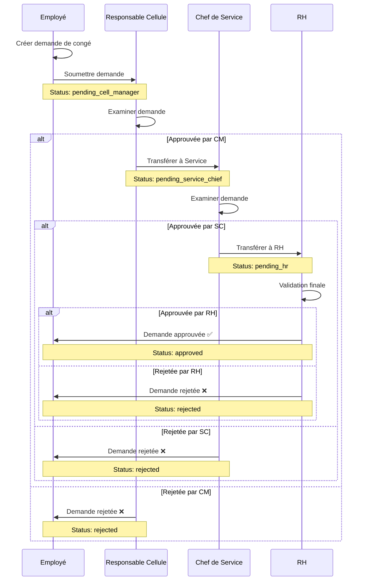

# Diagramme de Cas d'Utilisation

## Système de Gestion des Congés

```mermaid
graph TB
    subgraph "Système de Gestion des Congés"
        UC1[S'authentifier]
        UC2[Consulter son profil]
        UC3[Modifier son profil]
        UC4[Créer une demande de congé]
        UC5[Consulter ses demandes]
        UC6[Modifier sa demande en attente]
        UC7[Approuver/Rejeter demande - Cellule]
        UC8[Consulter demandes de l'équipe]
        UC9[Approuver/Rejeter demande - Service]
        UC10[Consulter demandes du service]
        UC11[Validation finale RH]
        UC12[Consulter toutes les demandes]
        UC13[Gérer les utilisateurs]
        UC14[Créer un utilisateur]
        UC15[Modifier les rôles]
        UC16[Supprimer un utilisateur]
        UC17[Consulter les statistiques]
        UC18[Générer des rapports]
        UC19[Consulter les notifications]
        UC20[Changer son mot de passe]
    end
    
    Employee[👤 Employé]
    CellManager[👔 Responsable de Cellule]
    ServiceChief[🎯 Chef de Service]
    HR[📋 Ressources Humaines]
    Admin[⚙️ Administrateur]
    
    Employee --> UC1
    Employee --> UC2
    Employee --> UC3
    Employee --> UC4
    Employee --> UC5
    Employee --> UC6
    Employee --> UC19
    Employee --> UC20
    
    CellManager --> UC1
    CellManager --> UC2
    CellManager --> UC3
    CellManager --> UC7
    CellManager --> UC8
    CellManager --> UC19
    CellManager --> UC20
    
    ServiceChief --> UC1
    ServiceChief --> UC2
    ServiceChief --> UC3
    ServiceChief --> UC9
    ServiceChief --> UC10
    ServiceChief --> UC19
    ServiceChief --> UC20
    
    HR --> UC1
    HR --> UC2
    HR --> UC3
    HR --> UC11
    HR --> UC12
    HR --> UC17
    HR --> UC18
    HR --> UC19
    HR --> UC20
    
    Admin --> UC1
    Admin --> UC2
    Admin --> UC3
    Admin --> UC13
    Admin --> UC14
    Admin --> UC15
    Admin --> UC16
    Admin --> UC17
    Admin --> UC18
    Admin --> UC19
    Admin --> UC20
```

## Description des Acteurs

### 👤 Employé (Employee)
Utilisateur standard du système qui peut soumettre et gérer ses propres demandes de congés.

**Responsabilités:**
- Soumettre des demandes de congés
- Consulter l'état de ses demandes
- Modifier ses demandes en attente
- Gérer son profil personnel

### 👔 Responsable de Cellule (Cell Manager)
Premier niveau d'approbation pour les demandes de congés de son équipe.

**Responsabilités:**
- Tout ce qu'un employé peut faire
- Approuver ou rejeter les demandes de sa cellule
- Consulter les demandes de son équipe
- Ajouter des commentaires aux décisions

### 🎯 Chef de Service (Service Chief)
Deuxième niveau d'approbation pour les demandes de congés du service.

**Responsabilités:**
- Tout ce qu'un employé peut faire
- Approuver ou rejeter les demandes de son service
- Consulter les demandes de tout le service
- Valider après approbation du responsable de cellule

### 📋 Ressources Humaines (HR)
Validation finale et gestion administrative des congés.

**Responsabilités:**
- Tout ce qu'un employé peut faire
- Validation finale de toutes les demandes
- Consulter toutes les demandes de l'organisation
- Générer des rapports et statistiques
- Vue globale sur les congés de l'entreprise

### ⚙️ Administrateur (Admin)
Gestion complète du système et des utilisateurs.

**Responsabilités:**
- Tout ce qu'un employé peut faire
- Créer, modifier et supprimer des utilisateurs
- Gérer les rôles et permissions
- Accéder aux statistiques système
- Configuration globale du système

## Cas d'Utilisation Détaillés

### 🔐 Authentification et Profil

| ID | Cas d'utilisation | Acteurs | Description |
|---|---|---|---|
| UC1 | S'authentifier | Tous | Connexion au système avec email/mot de passe |
| UC2 | Consulter son profil | Tous | Voir ses informations personnelles et professionnelles |
| UC3 | Modifier son profil | Tous | Mettre à jour ses informations (téléphone, etc.) |
| UC20 | Changer son mot de passe | Tous | Modification du mot de passe (obligatoire à la première connexion) |

### 📝 Gestion des Demandes de Congés

| ID | Cas d'utilisation | Acteurs | Description |
|---|---|---|---|
| UC4 | Créer une demande de congé | Employé | Soumettre une nouvelle demande avec type, dates, raison |
| UC5 | Consulter ses demandes | Employé | Voir l'historique et l'état de ses demandes |
| UC6 | Modifier sa demande en attente | Employé | Modifier une demande non encore approuvée |

### ✅ Workflow d'Approbation

| ID | Cas d'utilisation | Acteurs | Description |
|---|---|---|---|
| UC7 | Approuver/Rejeter demande - Cellule | Responsable Cellule | Première validation des demandes de la cellule |
| UC8 | Consulter demandes de l'équipe | Responsable Cellule | Voir toutes les demandes de sa cellule |
| UC9 | Approuver/Rejeter demande - Service | Chef de Service | Deuxième validation des demandes du service |
| UC10 | Consulter demandes du service | Chef de Service | Voir toutes les demandes de son service |
| UC11 | Validation finale RH | RH | Approbation finale de toutes les demandes |
| UC12 | Consulter toutes les demandes | RH | Vue globale sur toutes les demandes |

### 👥 Administration

| ID | Cas d'utilisation | Acteurs | Description |
|---|---|---|---|
| UC13 | Gérer les utilisateurs | Admin | Vue d'ensemble de la gestion des utilisateurs |
| UC14 | Créer un utilisateur | Admin | Ajouter un nouvel utilisateur au système |
| UC15 | Modifier les rôles | Admin | Changer les rôles et permissions des utilisateurs |
| UC16 | Supprimer un utilisateur | Admin | Retirer un utilisateur du système |

### 📊 Reporting et Statistiques

| ID | Cas d'utilisation | Acteurs | Description |
|---|---|---|---|
| UC17 | Consulter les statistiques | RH, Admin | Voir les KPIs et métriques du système |
| UC18 | Générer des rapports | RH, Admin | Créer des rapports sur les congés |

### 🔔 Notifications

| ID | Cas d'utilisation | Acteurs | Description |
|---|---|---|---|
| UC19 | Consulter les notifications | Tous | Voir les alertes et mises à jour importantes |

## Flux de Travail Principal

## Règles Métier

1. **Hiérarchie d'Approbation**
   - Une demande doit passer par tous les niveaux dans l'ordre
   - Chaque niveau peut approuver ou rejeter
   - Un rejet à n'importe quel niveau termine le workflow

2. **Modification des Demandes**
   - Seules les demandes avec status `pending` peuvent être modifiées par l'employé
   - Une fois en cours d'approbation, seul un rejet permet de soumettre une nouvelle demande

3. **Visibilité des Demandes**
   - Employés: uniquement leurs demandes
   - Managers: demandes de leur équipe/service
   - RH: toutes les demandes
   - Admin: toutes les demandes

4. **Notifications**
   - L'employé est notifié à chaque changement de statut
   - Les approbateurs sont notifiés des nouvelles demandes à traiter

5. **Changement de Mot de Passe**
   - Obligatoire à la première connexion (`must_change_password = true`)
   - Peut être changé à tout moment par l'utilisateur
